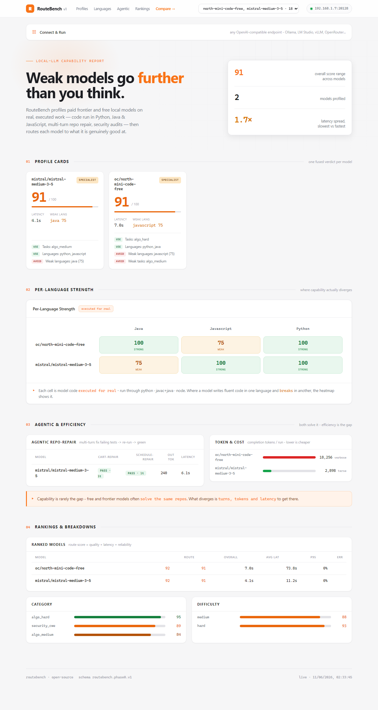
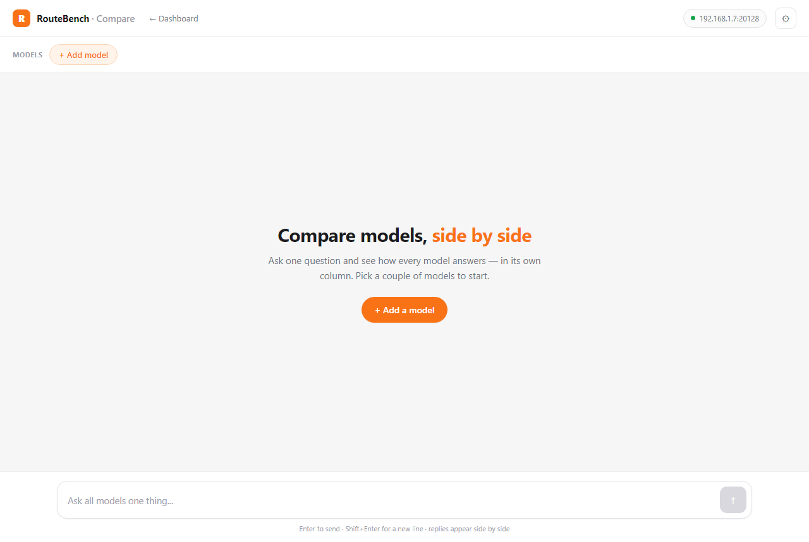

<div align="center">

# RouteBench

### Benchmark the models behind your OpenAI-compatible router — then route each task to the one that's actually good at it.

[](https://github.com/GodrezJr2/RouteBench/actions/workflows/ci.yml)
[](LICENSE)
[](package.json)
[](#tests)
[](CONTRIBUTING.md)

A local-first CLI **and** dashboard that profiles LLMs on **real, executed work** — running their code against unit tests, repairing broken repos turn-by-turn — and turns the numbers into a **routing decision** you can export straight into your gateway.

**Router-first, not leaderboard-first.** The output isn't a single "best model" — it's a per-task routing rule.

[Quickstart](#quickstart-no-endpoint-needed) · [Why](#why) · [What makes it different](#what-makes-it-different) · [Dashboard](#the-dashboard) · [Packs](#benchmark-packs) · [Contributing](#contributing)



</div>

---

## Table of contents

- [Why](#why)
- [Quickstart (no endpoint needed)](#quickstart-no-endpoint-needed)
- [Run against a real endpoint](#run-against-a-real-endpoint)
- [What makes it different](#what-makes-it-different)
- [The dashboard](#the-dashboard)
- [Benchmark packs](#benchmark-packs)
- [Output](#output)
- [Architecture](#architecture)
- [Security](#security)
- [Tests](#tests)
- [Roadmap](#roadmap)
- [Contributing](#contributing)
- [License](#license)

---

## Why

Most benchmarks rank models on one global score. But a fast model can win overall and still lose on prompt-injection resistance; a free model can ace Python and stumble on Java. If you run several models behind one router (9router, LiteLLM, OpenRouter, vLLM, Ollama, LM Studio, llama.cpp, or your own gateway), the real question is:

> *Which model is cheapest, fastest, and safest **for this specific task**?*

RouteBench answers that and emits a routing config you can drop into your gateway.

---

## Quickstart (no endpoint needed)

```bash
git clone https://github.com/GodrezJr2/RouteBench
cd RouteBench
npm run demo
```

Generates `results/demo-report.md` — a full Markdown report comparing two sample models, fully offline. No API key, no install step (RouteBench runs on the Node 20+ standard library).

Open the dashboard:

```bash
npm run view          # http://localhost:3001
```

---

## Run against a real endpoint

**1. Copy the example config** (it's gitignored — your key is never committed):

```bash
cp routebench.config.example.json routebench.config.json
```

**2. Edit it:**

```json
{
  "base_url": "https://your-router.example.com/v1",
  "api_key": "sk-...",
  "models": ["model-a", "model-b"],
  "timeout_ms": 30000
}
```

Env vars override the file: `ROUTEBENCH_BASE_URL`, `ROUTEBENCH_API_KEY`, `ROUTEBENCH_MODELS`. `OPENAI_BASE_URL` / `OPENAI_API_KEY` work as fallbacks. The API key is **optional** for local engines (Ollama, LM Studio).

**3. Run:**

```bash
npm run bench -- --output results/results.json --report results/report.md --route-output results/routing.json
```

`results/routing.json` is a clean router export — **no API key included** — with per-task `category_rules`.

---

## What makes it different

Atomic Q&A benchmarks don't separate frontier models from capable free ones — modern models all ace them (RouteBench measures this and says so out loud). The signal lives in **executed** and **multi-turn** work:

### 🧪 Per-language execution (`code_exec`)

`benchmarks/polyglot-hard.json` makes each model write **Python, Java, and JavaScript**, then runs the generated code against real unit tests via the actual `python`, `javac`+`java`, and `node` runtimes. The report shows a models × languages score matrix that exposes uneven strength.

```bash
ROUTEBENCH_MODELS="oc/north-mini-code-free,kr/claude-sonnet-4.6" npm run bench:polyglot
```

### 🔁 Agentic repo repair (multi-turn)

`npm run bench:agentic` hands a model a small broken repo with a failing `node --test` suite. The model replies with corrected files, the harness applies them, re-runs the tests, and feeds the result back — up to N turns. Score = did the suite go green, and in how many turns. **This is what actually separates models.**

```bash
ROUTEBENCH_MODELS="oc/north-mini-code-free,kr/claude-sonnet-4.6" npm run bench:agentic
```

### 🎯 Model Profile Cards

`npm run profile` fuses every axis — quality, latency, tokens/cache, per-category, per-language, per-difficulty, and agentic repair — into **one verdict card per model** with a role tag and use-for / avoid-for guidance:

```
## mistral/mistral-medium-3-5
Role: SPECIALIST · Overall 91 · moderate latency · errors 0%
- Per-language: python 100 · javascript 100 · java 75 (weakest java)
- Agentic: solved 2/2 (100%), avg 1 turn
Use for: python/javascript, multi-step repo work, high-volume/token-budget work
Avoid for: java (75)
```

Roles: **DAILY DRIVER** · **HEAVY CODER** · **SPECIALIST** · **LIMITED**.

---

## The dashboard

`npm run view` serves a complete tool in one page:

- **Connect & Run** — point at any OpenAI-compatible endpoint (one-click chips for Ollama / LM Studio / llama.cpp / vLLM / OpenRouter, or paste your own), discover models, pick which to benchmark, choose a pack, run with a live progress bar.
- **Visualize** — finished runs render inline: profile cards, per-language heatmap, agentic results, rankings, category/difficulty bars, token/cost. A run selector lists every `results/*.json`; sections auto-hide when a run lacks them.
- **Compare** (`/compare`) — a multi-turn chat room where one prompt fans out to up to 6 models into side-by-side conversation columns, each with token count + latency. A model that errors shows its error in its own column without breaking the others.



The API key lives in process memory only — never written to disk, never returned to the browser.

---

## Benchmark packs

| Pack | Cases | What it measures |
|---|---|---|
| `benchmarks/phase0.json` | 30 | General router smoke test |
| `benchmarks/claude-code-compat.json` | 26 | Code-gen + reasoning + injection for coding-agent routing |
| `benchmarks/frontier.json` | 39 | Single-turn algorithms / JS semantics / security / injection |
| `benchmarks/code-assistant.json` | 30 | Coding-assistant replacement eval (repair, architecture, security audit, backend patterns, scheduler) |
| `benchmarks/polyglot-hard.json` | 18 | Per-language profiling — 4 hard algorithms run for real in Python/Java/JS + 6 CWE/security cases |

> **Honest limitation, stated up front:** the single-turn packs validate a *baseline quality threshold* and compare *latency + injection resistance* — they do **not** rank model intelligence. Free OpenCode models and paid GPT-5.5 / Sonnet-4.6 all score 92–100 on `frontier.json`. For capability separation, use the agentic harness.

---

## Output

**`results/*.json`** (`routebench.phase0.v1`) — models, test cases, per-case output/score/latency/status/usage/errors, per-model aggregate, ranked recommendation.

**`results/*.md`** — primary/fallback recommendation with reasons, ranked table, per-category routing, per-language breakdown, token usage, failed-case details.

**`results/routing.json`** (`routebench.routing.v1`) — clean router export, **no API key**:

```json
{
  "schema_version": "routebench.routing.v1",
  "primary_model": "model-a",
  "fallback_models": ["model-b"],
  "category_rules": [
    { "category": "prompt_injection", "primary_model": "model-b", "reason": "..." }
  ]
}
```

Convert it to LiteLLM or generic router config:

```bash
npm run routing:export -- --input results/routing.json --format litellm --output results/litellm-config.yaml
```

---

## Architecture

```
routebench.config.json + env vars
        ↓
/v1/models discovery
        ↓
/v1/chat/completions benchmark
        ↓
deterministic scorers  (exact · JSON schema · contains · code_exec · agentic · prompt-injection)
        ↓
aggregation + weighted recommendation  (overall + per-category + per-language)
        ↓
results/*.json · results/*.md · results/routing.json
```

| File | Role |
|---|---|
| `src/cli.js` / `src/cliCore.js` | command entrypoint + orchestration |
| `src/openaiClient.js` | OpenAI-compatible client (single + multi-turn, retry/parse core) |
| `src/runner.js` | benchmark loop, cost calc, result classification |
| `src/scoring.js` | scorers, aggregation, recommendation |
| `src/codeExec.js` | multi-language execution scorer (Python/Java/JS) |
| `src/agentic.js` | multi-turn broken-repo repair harness |
| `src/profile.js` | Model Profile Cards + dashboard payload |
| `src/report.js` | Markdown report renderer |
| `src/viewerServer.js` | dashboard + compare + `/api/*` server |

---

## Security

- API keys live in process memory only — never written to disk, never returned to the frontend; redacted from logs; omitted from exported router config.
- Provider/model errors are saved as result rows, not thrown away.
- External calls are timeout-bounded.
- `code_exec` and the agentic harness run model-generated code via `spawnSync` with an **argument array (no shell)** in a throwaway temp dir — no command-injection surface. This is *not* a hardened sandbox: run it against trusted endpoints, on a machine without secrets.

---

## Tests

```bash
npm test          # 201 passing
npm run lint      # syntax check
```

No test framework — just Node's built-in `node --test`. Tests needing `python` / `javac` / `java` self-skip when those runtimes are absent, so the suite is green on a bare Node install.

---

## Roadmap

RouteBench is currently a local-first proof of concept (Phase 0.5). Direction, not promises:

- [ ] Cost-aware routing rules (route by $/task, not just quality)
- [ ] More agentic fixtures (larger repos, more languages)
- [ ] Tool-calling and RAG benchmark categories
- [ ] LLM-as-judge for open-ended categories (opt-in; deterministic stays the default)
- [ ] Hosted/shareable run reports

Ideas and PRs welcome — see [Contributing](#contributing).

---

## Contributing

Contributions are welcome. The dev loop is fast — no production dependencies, no endpoint required to run the tests:

```bash
npm test && npm run lint
```

See **[CONTRIBUTING.md](CONTRIBUTING.md)** for project layout, how to add a benchmark pack, and the PR checklist.

---

## License

[MIT](LICENSE) © GodrezJr2
